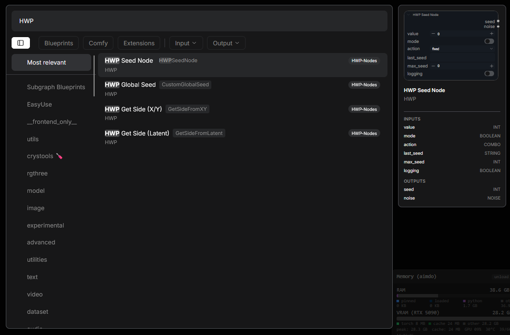
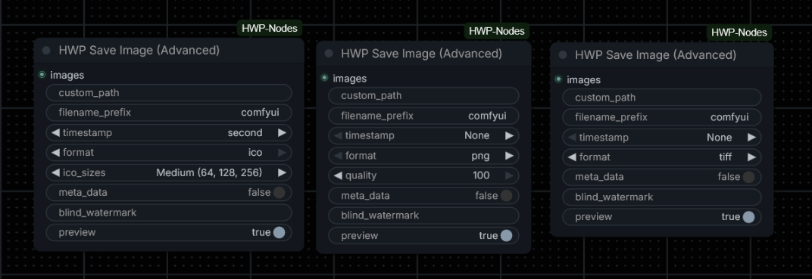

# ComfyUI-HWP-Nodes

A small collection of custom [ComfyUI](https://github.com/comfyanonymous/ComfyUI) nodes by [hwprinz](https://github.com/hwprinz), covering seed/noise control, simple latent/size utilities, and an advanced multi-format image save node.


<!-- TODO: add a screenshot showing the nodes in a workflow, then update the path above -->

## Nodes

| Node | File | Purpose |
|---|---|---|
| [HWP Global Seed](nodes/global_seed.py) | `global_seed.py` | Broadcasts one seed to every seed/noise widget in the workflow |
| [HWP Seed Node](nodes/seed_node.py) | `seed_node.py` | Local (non-broadcasting) seed + noise source for a single sampler |
| [HWP Get Side (Latent)](nodes/get_side_from_latent.py) | `get_side_from_latent.py` | Returns the longest/shortest pixel-space dimension of a `LATENT` |
| [HWP Get Side (X/Y)](nodes/get_side_from_xy.py) | `get_side_from_xy.py` | Returns the longest/shortest of a `width`/`height` pair |
| [HWP Save Image (Advanced)](nodes/image_save.py) | `image_save.py` | Multi-format save (PNG/JPG/WEBP/TIFF/ICO) with timestamps, metadata, blind watermark and per-file logging |

---

## Finding the nodes

All nodes are registered under the `HWP` category. To find them, just type `HWP` into the node search (right-click canvas → Add Node):



---

## HWP Global Seed

**File:** `nodes/global_seed.py` · **Category:** HWP

Global seed controller for ComfyUI workflows. Distributes a single seed value to every other `seed` / `seed_num` / `noise_seed` widget in the workflow, so you only need to manage one seed control instead of one per sampler.


<!-- TODO: screenshot of the node + the 🎲 button -->

### Inputs

| Input | Type | Default | Description |
|---|---|---|---|
| `value` | INT | `0` | The base seed |
| `mode` | ENUM | `control_before_generate` | `control_before_generate` computes the next seed before this run's prompt is sent (this run uses the new value); `control_after_generate` uses the current value now and prepares the next one for the following queue |
| `action` | ENUM | `fixed` | `fixed`, `increment`, `decrement`, `randomize`, or their `... for each node` variants (see below) |
| `max_seed` | INT | `0` (→ `1125899906842624`) | Ceiling that increment/decrement wraps at |
| `logging` | ENUM | `default` | `default` logs one summary line per run; `verbose` also logs per-node seed updates |

The plain `action` variants advance one shared value for every node. The `... for each node` variants give each downstream seed widget its own successive value — e.g. `increment for each node` hands out `value`, `value+1`, `value+2`, …

### Outputs

| Output | Type | Description |
|---|---|---|
| `seed` | INT | The resolved seed value |
| `noise` | NOISE | The same seed wrapped as a ready-to-use noise object (via ComfyUI's own `Noise_RandomNoise`) — useful for workflows (e.g. Flux.2 / `SamplerCustomAdvanced`) that need a `NOISE` input directly, without a separate `RandomNoise` converter node |

---

## HWP Seed Node

**File:** `nodes/seed_node.py` · **Category:** HWP

A **local** seed + noise source — the non-global counterpart of HWP Global Seed. It looks and behaves like HWP Global Seed (see screenshot above) — the only difference is that it does **not** broadcast anything: the outputs only reach the node(s) you explicitly wire them to. It exposes the same `seed`/`noise` outputs and the same `fixed`/`increment`/`decrement`/`randomize` actions. Use it when you want a controllable seed for one specific sampler without touching the rest of the workflow.

### Inputs

| Input | Type | Default | Description |
|---|---|---|---|
| `value` | INT | `0` | The base seed |
| `mode` | ENUM | `control_before_generate` | Same semantics as HWP Global Seed |
| `action` | ENUM | `fixed` | `fixed`, `increment`, `decrement`, or `randomize` |
| `max_seed` | INT | `0` (→ `1125899906842624`) | Ceiling that increment/decrement wraps at, and cap for randomize |
| `logging` | ENUM | `default` | `default` logs one summary line per run; `verbose` also logs per-run seed detail |

### Outputs

| Output | Type | Description |
|---|---|---|
| `seed` | INT | The resolved seed value |
| `noise` | NOISE | The same seed wrapped as a ready-to-use noise object (via ComfyUI's own `Noise_RandomNoise`) |

---

## HWP Get Side (Latent)

**File:** `nodes/get_side_from_latent.py` · **Category:** HWP

Takes a `LATENT` input and returns either its longest or shortest pixel-space dimension (auto-converted from latent space via ×8), selected with a longest/shortest toggle.

The computed value is also displayed below the node after a run (bare number, like the built-in `Get Image Size` node).

### Inputs

| Input | Type | Default | Description |
|---|---|---|---|
| `latent` | LATENT | — | The latent to measure |
| `side` | ENUM | `longest` | `longest` or `shortest` |

### Outputs

| Output | Type | Description |
|---|---|---|
| `side` | INT | The selected pixel-space dimension |

---

## HWP Get Side (X/Y)

**File:** `nodes/get_side_from_xy.py` · **Category:** HWP

Takes `width`/`height` integers and returns either the longest or shortest of the two, selected with the same longest/shortest toggle.

The computed value is also displayed below the node after a run (bare number, like the built-in `Get Image Size` node).

### Inputs

| Input | Type | Default | Description |
|---|---|---|---|
| `width` | INT | — | Width value |
| `height` | INT | — | Height value |
| `side` | ENUM | `longest` | `longest` or `shortest` |

### Outputs

| Output | Type | Description |
|---|---|---|
| `side` | INT | The selected value |

---

## HWP Save Image (Advanced)

**File:** `nodes/image_save.py` · **Category:** HWP

An advanced terminal save node modeled on LayerStyle's `SaveImage Plus (Advanced)`, extended with **TIFF**, **WEBP** and **multi-resolution ICO** output. Unlike the core `Save Image` node it writes exactly the file the widget says, keeps a per-file `-> Saved image to <full path>` log line for every written file, and supports timestamped filenames, workflow metadata and an invisible blind watermark.


<!-- TODO: screenshot of the node in a workflow -->

### Inputs

| Input | Type | Default | Description |
|---|---|---|---|
| `images` | IMAGE | — | The image batch to save (one file per image) |
| `custom_path` | STRING | `""` | Directory to save into (created if missing); empty = ComfyUI's `output/` folder. Supports `%date` and `%time` tokens |
| `filename_prefix` | STRING | `comfyui` | Base filename; also supports `%date` and `%time` tokens |
| `timestamp` | ENUM | `None` | Appends `_NNNNN` (counter), `_YYYY-MM-DD_HH-MM-SS` (second) or `_YYYY-MM-DD_HH-MM-SS-mmm` (millisecond) to the filename |
| `format` | ENUM | `png` | `png`, `jpg`, `webp`, `webp (lossless)`, `tiff`, `ico` |
| `quality` | INT | `100` | See the per-format table below — hidden in the UI when the format ignores it (`webp (lossless)`, `tiff`, `ico`) |
| `ico_sizes` | ENUM | `Medium (64, 128, 256)` | ICO resolution preset — hidden in the UI until `format` is `ico` (the value is still sent and ignored for other formats) |
| `meta_data` | BOOLEAN | `False` | Embed the workflow prompt + metadata (PNG text chunks, or EXIF `UserComment` JSON for jpg/webp/tiff). Honours the core `--disable-metadata` flag. ICO cannot store metadata (a warning is logged) |
| `blind_watermark` | STRING | `""` | Text to embed invisibly (QR payload spread across the full RGB image — lossless PNG output preserves it). Extractable with the [`blind_watermark`](https://pypi.org/project/blind-watermark/) library using `password_img=1`, `password_wm=1`; images too small to carry the payload are saved without it (a warning is logged) |
| `preview` | BOOLEAN | `True` | Show a result image in the UI. When saving to a `custom_path` the real files land there and a PNG preview is shown instead (saved to temp) |

**No output.** This is a terminal node.

### Formats and quality

| Format | Extension | Quality widget | Encoding |
|---|---|---|---|
| `png` | `.png` | compression level `(100 − q) // 10` (q 100 → level 0) | lossless, alpha preserved |
| `jpg` | `.jpg` | JPEG quality | 4:4:4 (`subsampling=0`); RGBA is composited over white |
| `webp` | `.webp` | WEBP quality | lossy, `method=6` (slowest, best ratio), alpha preserved |
| `webp (lossless)` | `.webp` | ignored | lossless, `method=6`, alpha preserved |
| `tiff` | `.tiff` | ignored | LZW — lossless, suited for final archive quality, alpha preserved |
| `ico` | `.ico` | ignored | multi-resolution ICO, 32-bit RGBA |

**ICO multi-resolution:** the `ico_sizes` preset picks the embedded sizes (e.g. `Small (32, 48, 64)`). Every size is resampled by PIL directly from the **full-resolution source image** — some other packs pre-resize the frames first and end up upscaling from the smallest entry, which is why their "multi-resolution" output looks soft; that defect does not apply here.

**Metadata layout:** PNG files get the prompt and each `extra_pnginfo` key as text chunks; JPG/WEBP/TIFF get a JSON blob `{"prompt": …, …extra_pnginfo}` in the EXIF `UserComment` tag (same layout as the other HWP-ecosystem save nodes).

---

## Shared Behaviour

- **Seed/noise pairing**: HWP Global Seed and HWP Seed Node both emit `seed` (INT) and `noise` (NOISE, via ComfyUI's `Noise_RandomNoise`), so either can feed a `SamplerCustomAdvanced`-style graph directly with no extra converter node.
- **Manual randomize**: both seed nodes get a client-side 🎲 "Manual Random Seed" button and live `value`/`last_seed` widget updates from the bundled JS extensions (`web/global_seed.js`, `web/seed_node.js`). They coexist in the same workflow without interfering with each other.
- **Logging**: both seed nodes support `default` (one summary line per run) and `verbose` (adds per-node/per-run seed detail) logging modes.

## Installation

```
cd ComfyUI/custom_nodes
git clone https://github.com/hwprinz/ComfyUI-HWP-Nodes
```

The blind watermark of HWP Save Image (Advanced) needs two extra Python packages that ComfyUI does not install automatically for clone installs. Run this once from the clone folder:

```
cd ComfyUI-HWP-Nodes
python -m pip install -r requirements.txt
```

Restart ComfyUI.

## License

MIT
