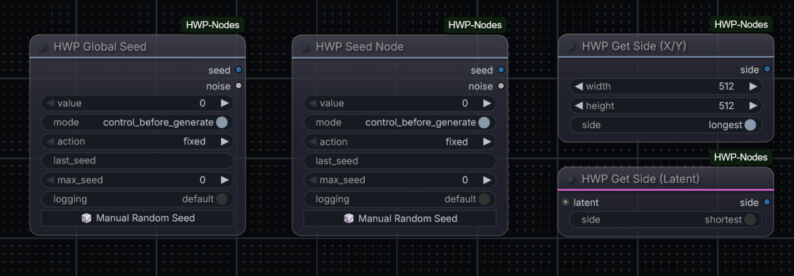
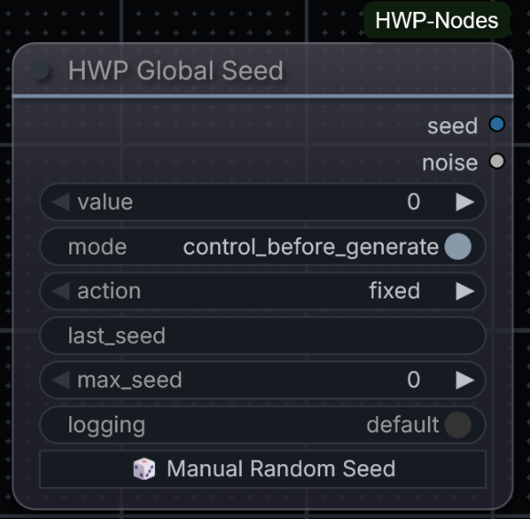

# ComfyUI-HWP-Nodes

A small collection of custom [ComfyUI](https://github.com/comfyanonymous/ComfyUI) nodes by [hwprinz](https://github.com/hwprinz), focused on seed/noise control and simple latent/size utilities.


<!-- TODO: add a screenshot showing the nodes in a workflow, then update the path above -->

## Nodes

| Node | File | Purpose |
|---|---|---|
| [HWP Global Seed](nodes/global_seed.py) | `global_seed.py` | Broadcasts one seed to every seed/noise widget in the workflow |
| [HWP Seed Node](nodes/seed_node.py) | `seed_node.py` | Local (non-broadcasting) seed + noise source for a single sampler |
| [HWP Get Side (Latent)](nodes/get_side_from_latent.py) | `get_side_from_latent.py` | Returns the longest/shortest pixel-space dimension of a `LATENT` |
| [HWP Get Side (X/Y)](nodes/get_side_from_xy.py) | `get_side_from_xy.py` | Returns the longest/shortest of a `width`/`height` pair |

---

## HWP Global Seed

**File:** `nodes/global_seed.py` · **Category:** utils

Global seed controller for ComfyUI workflows. Distributes a single seed value to every other `seed` / `seed_num` / `noise_seed` widget in the workflow, so you only need to manage one seed control instead of one per sampler.


<!-- TODO: screenshot of the node + the 🎲 button -->

### Inputs

| Input | Type | Default | Description |
|---|---|---|---|
| `value` | INT | `0` | The base seed |
| `mode` | ENUM | `control_before_generate` | `control_before_generate` computes the next seed before this run's prompt is sent (this run uses the new value); `control_after_generate` uses the current value now and prepares the next one for the following queue |
| `action` | ENUM | `fixed` | `fixed`, `increment`, `decrement`, `randomize`, or their `... for each node` variants (see below) |
| `max_seed` | INT | `0` (→ `1125899906842624`) | Ceiling that increment/decrement wraps at |
| `logging` | ENUM | `default` | `default` logs one summary line per run; `verbose` also logs per-node seed updates |

The plain `action` variants advance one shared value for every node. The `... for each node` variants give each downstream seed widget its own successive value — e.g. `increment for each node` hands out `value`, `value+1`, `value+2`, …

### Outputs

| Output | Type | Description |
|---|---|---|
| `seed` | INT | The resolved seed value |
| `noise` | NOISE | The same seed wrapped as a ready-to-use noise object (via ComfyUI's own `Noise_RandomNoise`) — useful for workflows (e.g. Flux.2 / `SamplerCustomAdvanced`) that need a `NOISE` input directly, without a separate `RandomNoise` converter node |

---

## HWP Seed Node

**File:** `nodes/seed_node.py` · **Category:** utils

A **local** seed + noise source — the non-global counterpart of HWP Global Seed. Exposes the same `seed`/`noise` outputs and the same `fixed`/`increment`/`decrement`/`randomize` actions, but does **not** broadcast anything: the outputs only reach the node(s) you explicitly wire them to. Use it when you want a controllable seed for one specific sampler without touching the rest of the workflow.


<!-- TODO: screenshot of the node -->

### Inputs

| Input | Type | Default | Description |
|---|---|---|---|
| `value` | INT | `0` | The base seed |
| `mode` | ENUM | `control_before_generate` | Same semantics as HWP Global Seed |
| `action` | ENUM | `fixed` | `fixed`, `increment`, `decrement`, or `randomize` |
| `max_seed` | INT | `0` (→ `1125899906842624`) | Ceiling that increment/decrement wraps at, and cap for randomize |
| `logging` | ENUM | `default` | `default` logs one summary line per run; `verbose` also logs per-run seed detail |

### Outputs

| Output | Type | Description |
|---|---|---|
| `seed` | INT | The resolved seed value |
| `noise` | NOISE | The same seed wrapped as a ready-to-use noise object (via ComfyUI's own `Noise_RandomNoise`) |

---

## HWP Get Side (Latent)

**File:** `nodes/get_side_from_latent.py` · **Category:** utils

Takes a `LATENT` input and returns either its longest or shortest pixel-space dimension (auto-converted from latent space via ×8), selected with a longest/shortest toggle.

### Inputs

| Input | Type | Default | Description |
|---|---|---|---|
| `latent` | LATENT | — | The latent to measure |
| `side` | ENUM | `longest` | `longest` or `shortest` |

### Outputs

| Output | Type | Description |
|---|---|---|
| `side` | INT | The selected pixel-space dimension |

---

## HWP Get Side (X/Y)

**File:** `nodes/get_side_from_xy.py` · **Category:** utils

Takes `width`/`height` integers and returns either the longest or shortest of the two, selected with the same longest/shortest toggle.

### Inputs

| Input | Type | Default | Description |
|---|---|---|---|
| `width` | INT | — | Width value |
| `height` | INT | — | Height value |
| `side` | ENUM | `longest` | `longest` or `shortest` |

### Outputs

| Output | Type | Description |
|---|---|---|
| `side` | INT | The selected value |

---

## Shared Behaviour

- **Seed/noise pairing**: HWP Global Seed and HWP Seed Node both emit `seed` (INT) and `noise` (NOISE, via ComfyUI's `Noise_RandomNoise`), so either can feed a `SamplerCustomAdvanced`-style graph directly with no extra converter node.
- **Manual randomize**: both seed nodes get a client-side 🎲 "Manual Random Seed" button and live `value`/`last_seed` widget updates from the bundled JS extensions (`web/global_seed.js`, `web/seed_node.js`). They coexist in the same workflow without interfering with each other.
- **Logging**: both seed nodes support `default` (one summary line per run) and `verbose` (adds per-node/per-run seed detail) logging modes.

## Installation

```
cd ComfyUI/custom_nodes
git clone https://github.com/hwprinz/ComfyUI-HWP-Nodes
```

Restart ComfyUI.

## License

MIT
